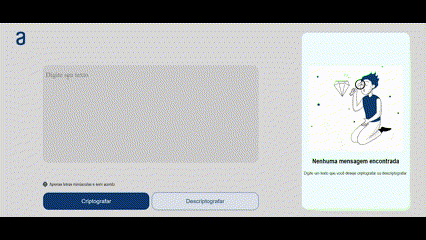

<h1 align="center">Encriptador & Desencriptador</h1>

# Índice 
* [Índice;](#índice)
* [Descrição do Projeto;](#descrição-do-projeto)
* [Status do Projeto](#status-do-projeto)
* [Funcionalidades;](#funcionalidades)
* [Demonstração da Aplicação;](#demonstração-da-aplicação)
* [Tecnologias utilizadas;](#tecnologias-utilizadas)
* [Pessoas Contribuidoras;](#pessoas-contribuidoras)
* [Pessoas Desenvolvedoras do Projeto;](#pessoas-desenvolvedoras-do-projeto)
* [Conclusão;](#conclusão)
* [Nota;](#nota)

# Descrição do Projeto

Uma aplicação super divertida para criptografar mensagens. Use para trocar aquela ideia legal e descontraida com a galera, de maneira que somente as pessoas que usarem a aplicação, vão entender o conteúdo das mensagens.

# Status do Projeto
<h4 align="center">🆗Projeto finalizado 🆗 </h4>

# Funcionalidades
<ul>
<li>Funcionalidade 1: Receber a mensagem;</li>
<li>Funcionalidade 2: Criptografar a mensagem e retorna o resultado;</li>
<li>Funcionalidade 2a: *Relacionada à funcionalidade 2* => Copiar o resultado do texto criptografado;</li>
<li>Funcionalidade 3: Colar o texto copiado;</li>
<li>Funcionalidade 3a: *Relacionada à funcionalidade 3* => Descriptografar a mensagem e retornar o resultado;</li>
</ul>

# Demonstração da Aplicação

# Tecnologias utilizadas

HTML 5, CSS3, JavaScript

# Pessoas contribuidoras

Alysson, Alura Team, Comunidade da Alura no discord

# Pessoas Desenvolvedoras do Projeto

Made by ☺Alysson☻ 10/07/2024

# Conclusão

Desenvolver pequenos projetos assim, nos motiva a continuar o aprendizado e quem sabe um dia, criptografar mensagens para uma empresa/organização importante, com um programa criado por nós mesmos.

# Nota

Acesse minhas redes sociais no rodapé da página da aplicação.
